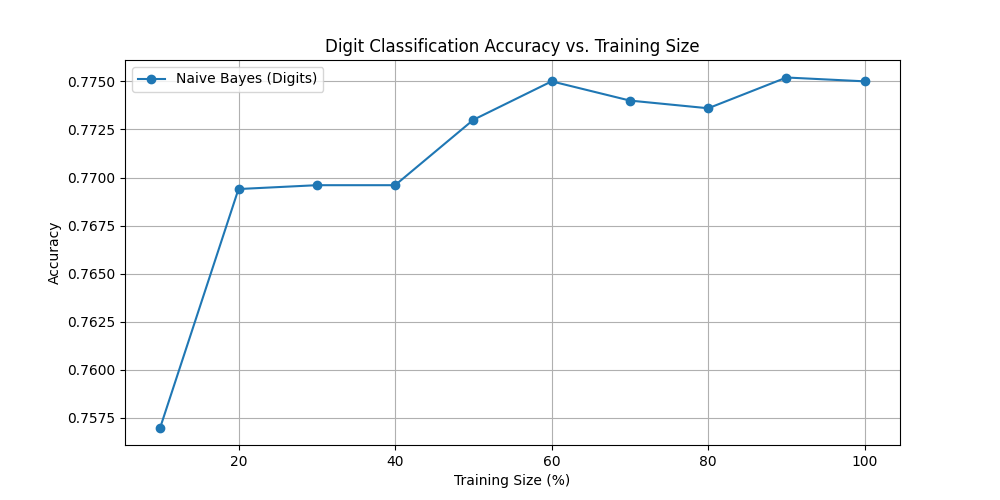
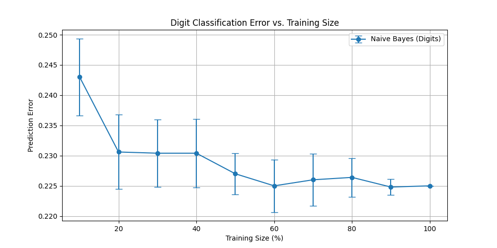
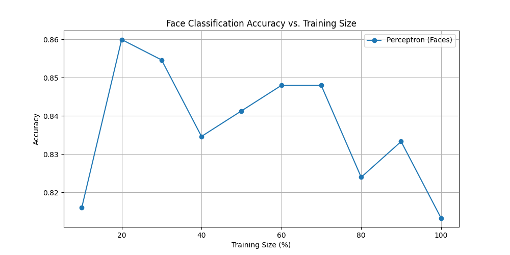
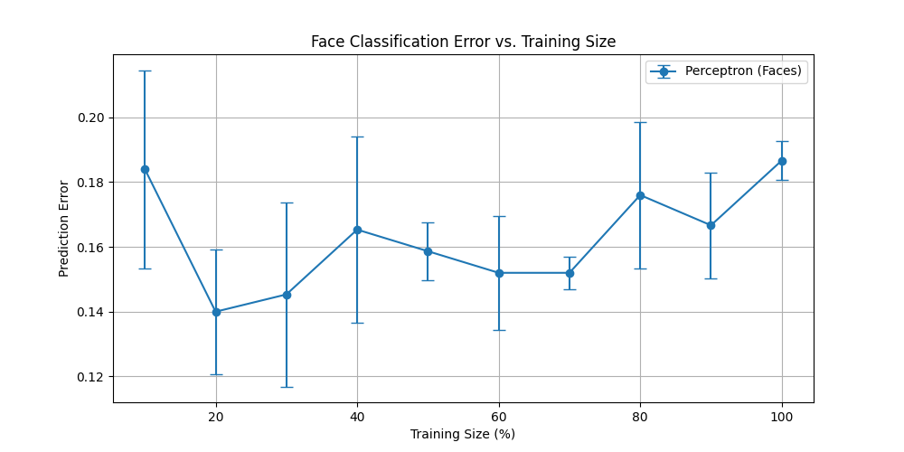

# 🧠 Face & Digit Recognition using Naive Bayes and Perceptron

This machine learning project explores the performance of **Naive Bayes** and **Multi-class Perceptron** classifiers on custom datasets for digit and face image recognition. We evaluate how model accuracy, error rate, and training time vary with different training data sizes.

---

## 📁 Project Structure

```
├── maincode.py              # Main training, evaluation, and visualization script
├── data/                    # Contains digit and face datasets
│   ├── digitdata/
│   └── facedata/
├── *.png                    # Plots for model accuracy, error, and training time
```

---

## 🧪 Models Implemented

- ✅ **Naive Bayes Classifier** (Bernoulli)
- ✅ **Multi-class Perceptron**

---

## 📊 Key Results

| Classifier           | Accuracy | Peak Training Time |
|----------------------|----------|---------------------|
| Naive Bayes (Digits) | ~77.5%   | ~0.01s              |
| Perceptron (Faces)   | ~86.0%   | ~0.30s              |

---

## 📈 Visualizations

|  |  |
|--------------------------------------------------------|--------------------------------------------------|
| Accuracy vs Training Size (Digits)                    | Prediction Error vs Training Size (Digits)       |

|  |  |
|------------------------------------------------------|------------------------------------------------|
| Accuracy vs Training Size (Faces)                   | Prediction Error vs Training Size (Faces)     |

---

## ⚙️ Features

- Custom ASCII-based image data loader
- Binary and block threshold feature extraction
- Model evaluation with varying training sizes
- Visualization with error bars and runtime metrics

---

## ▶️ How to Run

```bash
# Clone the repository
git clone https://github.com/your-username/face-digit-recognition.git
cd face-digit-recognition

# Run main script
python3 maincode.py
```

Ensure that the `data/` folder is present with all required training, validation, and test files.

---

## 📚 Libraries Used

- `NumPy`, `Matplotlib`, `Scikit-learn`

---

## 🙌 Credits

Developed by **Sahil Sharma** as part of an academic ML project.
